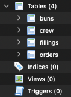
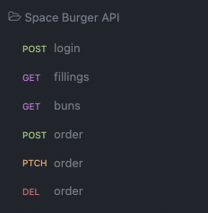

# Midweight Laravel Developer Task

## Task: Space Burger API

Fresh supplies have just arrived at the space station and tourist season is
approaching. Our head chef needs a system that can quickly create our signature
Space Burger™ from a range of fillings. Currently, orders can contain only one
filling and the chef would like to allow the crew to select multiple fillings.

## Instructions

1. Create a Laravel (version 9) project.

2. Update the sqlite database (using migrations) to allow multiple fillings per 
order.

3. Using the sqlite DB, produce an API in a Laravel instance with these endpoints.

4. Please log (using the Laravel logger) the post order query.
5. Cache the `buns` and `fillings` for an hour.
6. Create a console command to sum up all orders and output the result to the
console.
7. Please create and use the `README` to document your process or any other
documentation you would like to use.
8. Feel free to commit your work to a public GitHub repo or send it as a zip
when you're finished.

Most importantly, have fun and show us what you can do!