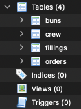
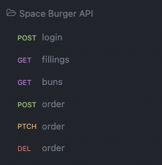

# Senior Laravel Developer Task

## Task: Space Burger API

Fresh supplies have just arrived at the space station and tourist season is
approaching. Our head chef needs a system that can quickly create our signature
Space Burger™ from a range of fillings. Currently, orders can contain only one
filling and the chef would like to allow the crew to select multiple fillings.

## Instructions

1. Create a Laravel (version 9) project.

2. Update the sqlite database (using migrations) to allow multiple fillings per order without losing any existing data of previous orders.

3. Produce an API in a Laravel instance with these endpoints.

4. Cache the `buns` and `fillings` for an hour and then use this cache to return the buns and fillings on subsequent API calls to those endpoints.
5. Create a console command to sum up all orders and output the total price to the console.
6. Create a `mailable` that sends an email to an address with details of the new order (this can just be a basic list of the bun, ingredients and price)
   1. Define the `to` email address in the `.env` file
   2. Ensure that this `mailable` is queued and not sent synchronously.
7. Provide full test coverage based on the above requirements. So, passing tests for having multiple fillings per bun in an order, that an order can be updated and deleted. Provide test coverage for all the other endpoints. Finally, provide tests for ensuring an email is successfully sent after an order has been made.
8. Please create and use the `README` to document your process or any other documentation you would like to use.
9. Feel free to commit your work to a public GitHub repo or send it as a zip when you're finished.

Most importantly, have fun and show us what you can do!